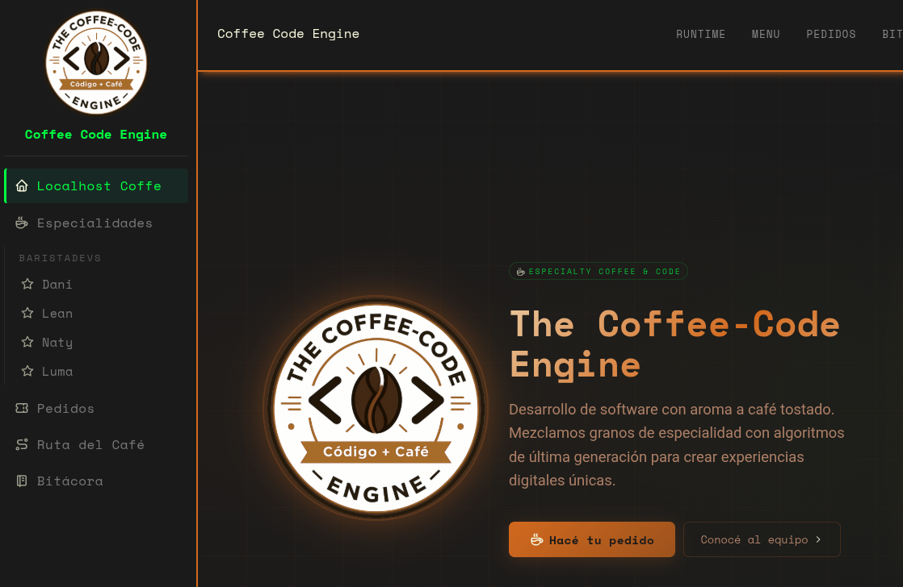
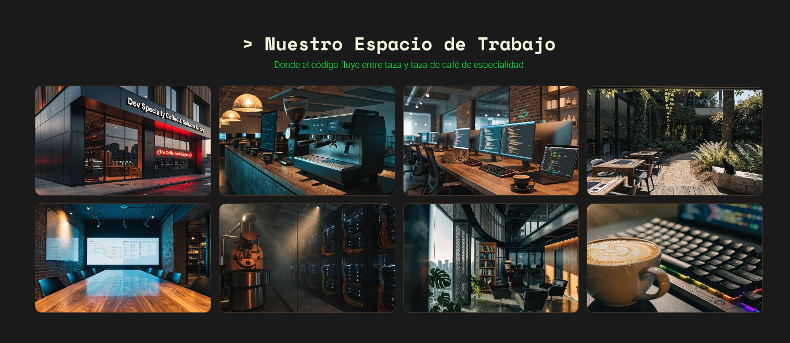
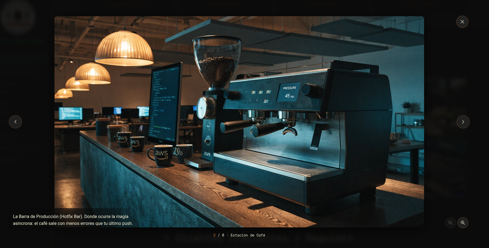
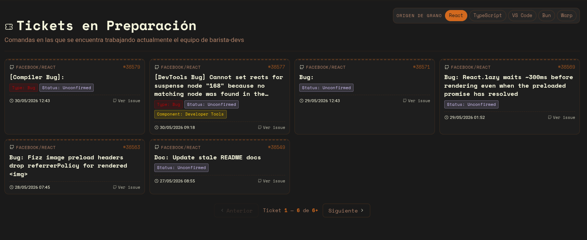
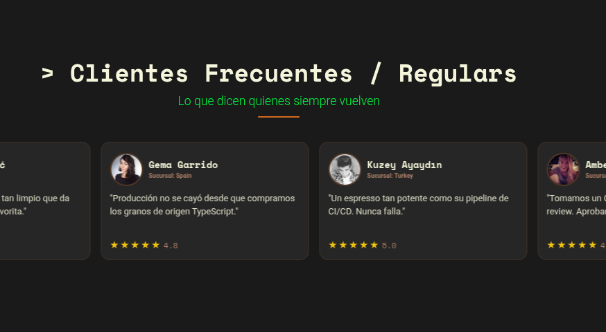
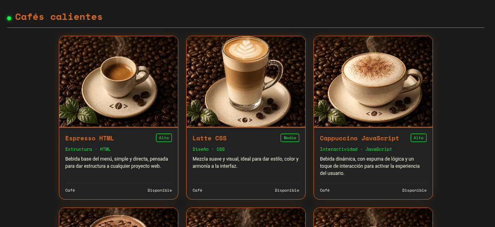
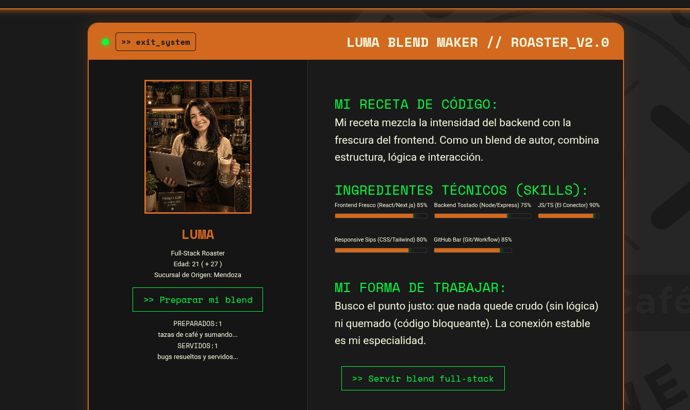
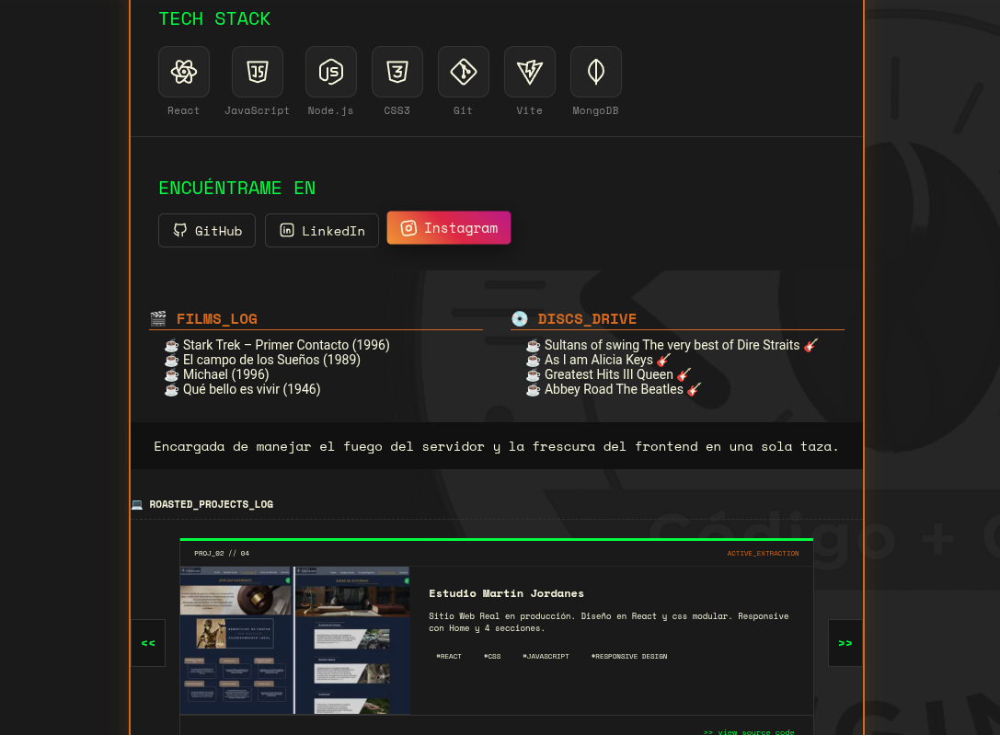
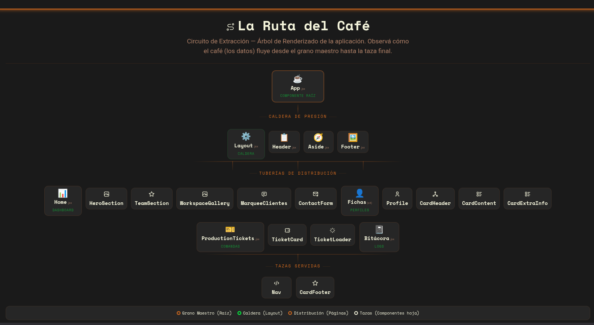
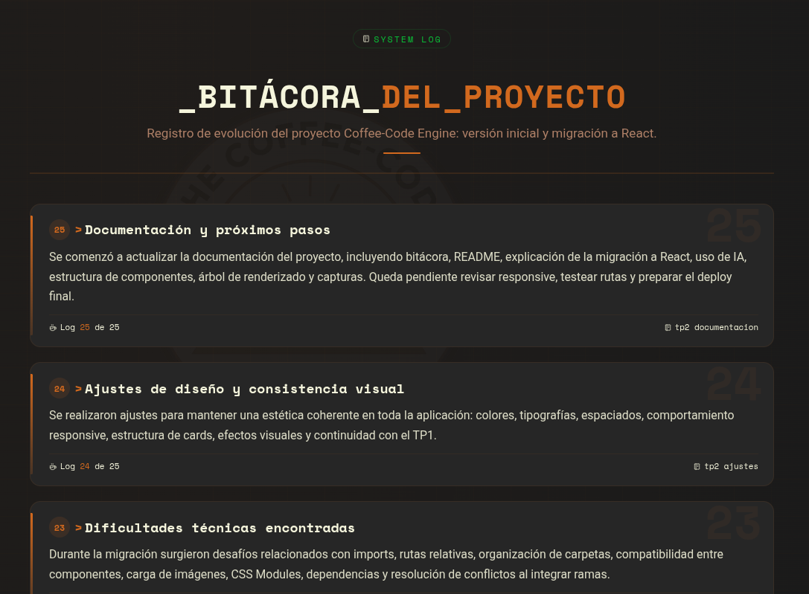

# ☕ The Coffee-Code Engine

> **Deploy en Vercel:** [Coffee-code Engine Vercel App](https://coffee-code-engine.vercel.app)  
> **Repositorio:** [Github Repository](https://github.com/Lean-R/frontend-tpg2-react)

---

## 📋 Descripción

The Coffee-Code Engine es una Single Page Application (SPA) desarrollada en equipo con React + Vite. Representa la evolución del Trabajo Práctico 1 (HTML/CSS/JS estático) hacia una arquitectura de componentes moderna. La aplicación presenta al equipo de desarrollo a través de un dashboard con perfiles individuales, cada uno con su propia ficha profesional, carrusel de proyectos, tech stack, galería de imágenes y más.

---

## 👥 Integrantes

| Nombre | GitHub |
|--------|--------|
| Natalia Burnazzi | [@NatyBu26](https://github.com/NatyBu26) |
| Leandro Rocha | [@Lean-R](https://github.com/Lean-R) |
| Luciana Quilcate | [@Luma2001](https://github.com/Luma2001) |
| Daniel Clementín | [@danielclementin](https://github.com/danielclementin) |

---

## 🛠️ Tecnologías Utilizadas

| Tecnología | Uso |
|------------|-----|
| [React 19](https://react.dev/) | Librería principal de UI |
| [Vite 8](https://vite.dev/) | Bundler y servidor de desarrollo |
| [React Router DOM 7](https://reactrouter.com/) | Navegación y ruteo de la SPA |
| [React Hook Form](https://react-hook-form.com/) | Manejo del formulario de contacto |
| [@tabler/icons-react](https://tabler.io/icons) | Librería de iconografía |
| CSS Modules | Estilos encapsulados por componente |
| [Google Fonts – Space Mono](https://fonts.google.com/specimen/Space+Mono) | Tipografía de títulos y cabeceras |
| [Google Fonts – Roboto](https://fonts.google.com/specimen/Roboto) | Tipografía de texto general |
| HTML5 | Estructura semántica base |

---

## 📁 Estructura de Archivos

```
frontend-tpg2-react/
│
├── public/
│   ├── data/               # Archivos JSON con datos de cada integrante
│   └── img/                # Imágenes y media del proyecto
│
└── src/
    ├── assets/             # Recursos estáticos del bundle
    ├── components/
    │   ├── aside/          # Sidebar fija de navegación
    │   ├── ContactForm/    # Formulario de contacto
    │   ├── footer/         # Pie de página
    │   ├── header/         # Cabecera
    │   ├── home/
    │   │   ├── hero-section/     # Sección principal del home
    │   │   └── team-section/     # Grilla de tarjetas del equipo
    │   ├── layout/         # Layout general de la app
    │   ├── logo/           # Componente de logo
    │   ├── MarqueeClientes/# Marquee animado
    │   ├── nav/            # Navegación
    │   ├── profile/        # Ficha de perfil individual
    │   │   ├── cardContent/      # Contenido principal de la card
    │   │   ├── cardExtraInfo/    # Films y discos
    │   │   ├── cardFooter/       # Pie de la card
    │   │   └── cardHeader/       # Cabecera de la card
    │   ├── TicketCard/     # Tarjeta de ticket
    │   ├── TicketLoader/   # Loader de tickets
    │   └── WorkspaceGallery/     # Galería del workspace
    │
    ├── pages/
    │   ├── bitacora/       # Bitácora del proyecto
    │   ├── CoffeeRoute/    # Sección temática
    │   ├── fichas/         # Páginas individuales (FichaDani, FichaLean, etc.)
    │   ├── home/           # Página principal
    │   └── ProductionTickets/    # Módulo de tickets
    │
    ├── routers/
    │   └── AppRouter.jsx   # Configuración de rutas
    ├── App.jsx
    ├── main.jsx
    └── index.css           # Variables globales y estilos base
```

---

## 🎨 Guía de Estilos

### Paleta de Colores

| Variable | Hex | Uso |
|----------|-----|-----|
| `--color-texto-principal` | `#f5f5dc` | Texto general (Beige / Crema) |
| `--color-fondo-principal` | `#1a1a1a` | Fondo base (Negro Obsidiana) |
| `--color-acento-primario` | `#d2691e` | Acentos y bordes (Chocolate / Tostado) |
| `--color-acento-secundario` | `#00ff41` | Estados OK (Verde Matrix) |
| `--color-fondo-principal-80` | `#262626` | Fondo variante claro 1 |
| `--color-fondo-principal-60` | `#333333` | Fondo variante claro 2 |
| `--color-text-muted` | `#ad7f66` | Texto secundario atenuado |

### Tipografías

- **Títulos y monospace:** [Space Mono](https://fonts.google.com/specimen/Space+Mono) — `font-family: "Space Mono", monospace`
- **Texto general:** [Roboto](https://fonts.google.com/specimen/Roboto) — `font-family: "Roboto", sans-serif`

### Iconografía

- **[@tabler/icons-react](https://tabler.io/icons)** — librería de iconos SVG para React, usada en el tech stack de perfiles y botones de navegación.

---

## ⚛️ JavaScript / React — Funciones y Componentes Clave

### Componentes principales

- **`AppRouter.jsx`** — Define todas las rutas de la SPA usando React Router DOM. Gestiona la navegación entre el Home, fichas individuales, bitácora y demás secciones.
- **`Profile`** — Componente compuesto que renderiza la ficha completa de cada integrante a partir de datos JSON. Integra `CardHeader`, `CardContent`, `CardExtraInfo` y `CardFooter`.
- **`CardContent`** — Muestra foto, rol, skills, receta de código y forma de trabajo. Incluye contadores interactivos de tazas y bugs.
- **`CardExtraInfo`** — Renderiza las listas de films y discos favoritos con tooltip interactivo al hacer hover.
- **`WorkspaceGallery`** — Galería de imágenes del workspace del equipo.
- **`ContactForm`** — Formulario de contacto implementado con React Hook Form.
- **`MarqueeClientes`** — Componente de marquee animado.

### Funciones dinámicas

- **Carga de datos desde JSON** — Cada ficha individual (`FichaDani`, `FichaLean`, etc.) usa `useEffect` + `fetch` para cargar su JSON correspondiente desde `/public/data/`.
- **Manejo de estados de carga** — `useState` para controlar los estados `loading` y `data` en cada ficha.
- **Renderizado condicional** — Las fichas muestran un mensaje de carga mientras el JSON no está disponible.
- **Mapeo dinámico de listas** — Skills, films y discos se renderizan mediante `.map()` sobre los arrays del JSON.


---

## 🔗 Enlace al Proyecto Desplegado

> _🚧 Enlace a aplicación desplegada en Vercel: [Coffee-code Engine Vercel App](https://coffee-code-engine.vercel.app)_

---

## 📈 Evolución del Proyecto

### De HTML/CSS/JS a React

El proyecto original (TP1) fue desarrollado como un sitio estático con HTML, CSS y JavaScript vanilla. La migración al TP2 implicó:

- **Componentización** — Cada sección pasó a ser un componente React reutilizable con estilos encapsulados via CSS Modules.
- **Ruteo con React Router** — La navegación entre perfiles dejó de depender de múltiples archivos HTML para funcionar como una SPA con rutas declarativas.
- **Gestión de datos con JSON** — Los datos de cada integrante se centralizaron en archivos JSON cargados dinámicamente con `fetch` y `useEffect`.
- **Estado reactivo** — Los contadores, estados de carga y filtros se gestionan con `useState` en lugar de manipulación directa del DOM.

### Mejoras incorporadas

#### Sidebar
Incorporación de sidebar fijo en el lateral izquierdo del sitio. Permite una navegación rápida y fluida entre cada página del sitio. Cuenta con un diseño moderno y atractivo, optimizado para funcionar de manera responsiva en pantallas pequeñas.



#### Lightbox
Incorporación de lightbox para mostrar imágenes en tamaño completo al hacer clic en ellas. Permite una visualización atractiva y sin distracciones de los contenidos del sitio.





#### Consumo de APIs externas

Integración de APIs externas.
Consumo asíncrono de los datos de la api de Github y Random User Generator.
La implementación maneja correctamente estados de carga y error e incluye un sistema de paginación al consumir los issues de Github. 

La API de Github se utiliza para buscar issues de repositorios públicos conocidos, simulando comandas de la cafetería en las que se encuentra trabajando el equipo de baristas.
- Url utilizada para api de Github: `https://api.github.com/search/issues?q=${query}&page=${pageNum}&per_page=${PER_PAGE}`

Adicionalmente, se integra la API de Random User Generator para obtener datos de usuarios aleatorios y simular reviews de clientes
- Url utilizada para api de Random User Generator: `https://randomuser.me/api/?results=12&seed=devcafe2026&inc=name,location,picture`





#### Explorador de datos locales JSON

Creación de archivo JSON con datos que simulan la carta de café de la cafetería. Los mismos se consumen localmente en la aplicación, permitiendo una visualización y exploración de las distintas variedades de café disponibles.

La página que consume los datos, incorpora un sistema de filtrado en tiempo real e incluye un buscador de texto que actualiza la vista en forma dinámica.



#### Mejoras en secciones individuales

Se realizaron diferentes mejoras en las secciones individuales de cada integrante del equipo. Se eliminó la repetición del código, creando un page reutilizable que recibe la información correspondiente a cada miembro del equipo, aprovechando las ventajas de utilizar React.

Cada page incorpora:
 - barras de progreso de habilidades, con animaciones para mostrar el progreso de manera visual y atractiva.
 - carrusel de proyectos tipo galería interactiva con controles manuales
 - Tech stack con iconografía y efectos visuales
 - botones de social media con efectos hover avanzados (cambio de color, transform y shadows)





#### Árbol de renderizado

Página completa donde se renderiza una representación gráfica, esquemática del árbol de renderizado de la aplicación. Detalla la estructura jerárquica, identificando el componente raíz, los componentes de nivel susperior y los componentes hoja mediante una representación visual, haciendo una analogía con la ruta del café, donde se representa cómo fluyen los datos de los componentes a través de la aplicación.



#### Actualización de bitacora del proyecto

Actualización de los registros de la bitácora del proyecto para ilustrar el progreso de esta segunda etapa. Incluye descripción detallada de los roles asignados y el flujo de trabajo del equipo.
Incopora animaciones suaves y lazy load para evitar que se cargue toda la información al inicio, lo que mejora la experiencia del usuario, la performance y reduce el tiempo de carga inicial.




---

## 🤖 Uso de Inteligencia Artificial

### Herramientas utilizadas

| Herramienta | Modelo |
|-------------|--------|
| [Claude](https://claude.ai) | Claude Sonnet (Anthropic) |
| [ChatGPT](https://chatgpt.com) | GPT-4o (OpenAI) |
| [Gemini](https://gemini.google.com) | Gemini 1.5 (Google) |

### Uso en contenido y código

- **Generación de contenido temático** — Los textos de las fichas de perfil (receta de código, forma de trabajar, descripciones de films y discos en clave "café") fueron generados y refinados con asistencia de Claude y ChatGPT, manteniendo coherencia con la estética del proyecto.
- **Estructura de componentes** — Claude asistió en la definición de la arquitectura de componentes y en la implementación de fichas individuales siguiendo el patrón establecido por el equipo.
- **Debugging y lógica** — Se utilizó IA para resolver problemas de carga asíncrona de JSON, manejo de estados y configuración de rutas en React Router.
- **Datos JSON** — Los archivos de datos de cada integrante fueron estructurados con asistencia de IA para mantener consistencia entre perfiles.

### Imágenes

- Las imágenes de perfil y media del proyecto fueron seleccionadas por el equipo. Los avatares e íconos temáticos fueron generados con herramientas de IA generativa utilizando prompts orientados a la estética "café + tecnología" del proyecto.

---
